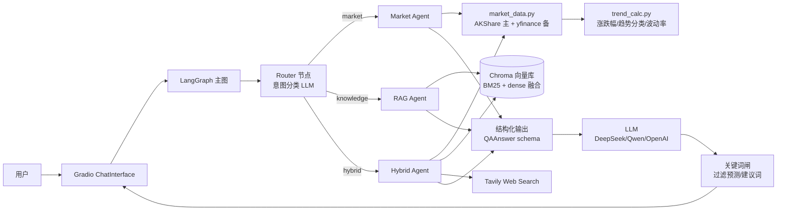

# 金融资产问答系统（Financial Asset QA System）

> 一个基于 **LangGraph 路由 Agent + LlamaIndex RAG + AKShare 行情** 的中文金融问答系统。
> 严格区分「客观数据」与「分析性描述」，行情走 API、知识走 RAG，**不预测未来走势**。

---

## 一、能力一览

| 类别 | 示例问题 | 走的链路 |
|---|---|---|
| 行情类 | 阿里巴巴当前股价是多少？ | Router → MarketAgent → AKShare |
| 行情类 | BABA 最近 7 天涨跌情况？ | Router → MarketAgent → AKShare → 趋势计算 |
| 知识类 | 什么是市盈率？ | Router → RAGAgent → Chroma 检索 |
| 知识类 | 收入和净利润的区别是什么？ | Router → RAGAgent → Chroma 检索 |
| 混合类 | 阿里巴巴最近为何 1 月 15 日大涨？ | Router → HybridAgent → AKShare + RAG + Web Search |

支持 **A 股 / 港股 / 美股 / 中概股** 任一标的，自动按代码格式或公司名解析。

---

## 二、系统架构



### 三道防幻觉闸（依次串联）

1. **数据闸**：行情数据强制以 `<data>` 标签注入 prompt；prompt 硬约束"只能引用 data 中的数字、不可编造"
2. **Schema 闸**：所有回答经 `QAAnswer` Pydantic 验证，分 `facts / analysis / citations / blocked_phrases / disclaimer` 字段
3. **关键词闸**：后处理正则过滤 "未来/将会/必涨/建议买入/稳赚" 等违禁词，命中位置替换为 `[已隐去]`，并自动追加免责声明

---

## 三、技术选型与对比

| 层 | 选型 | 备选 | 选型理由 |
|---|---|---|---|
| Agent 编排 | **LangGraph 0.2+** | TradingAgents、AutoGen | 显式状态机、checkpoint 可恢复；TradingAgents 内置买卖建议违反"不预测未来"要求；LangGraph 最贴合本项目"清晰路由"诉求 |
| RAG 框架 | **LlamaIndex Workflows** | LangChain RAG | LlamaIndex 在多文档检索质量、BM25/dense 融合上更成熟，2026 业界共识"LangGraph 编排 + LlamaIndex 检索" |
| 向量库 | **Chroma**（embedded） | Qdrant、Milvus、Weaviate | < 10 万向量场景下 Chroma 最简单，pip 即装、零运维；规模大了再迁移 |
| 嵌入模型 | **bge-small-zh-v1.5** | bge-m3、OpenAI embedding | 中文 SOTA、本地可跑、384 维省存储；首次使用会自动下载 ~95MB |
| 行情数据 | **AKShare** + **yfinance** 备份 | 单用 yfinance | yfinance 在中国大陆已不稳定（Cookie/Crumb 校验失败、TCP 重置）；AKShare 覆盖 A 股/港股/美股/中概股，文档示例（阿里巴巴/BABA/特斯拉）全覆盖 |
| Web 搜索 | **Tavily** | SerpAPI、Brave | 金融新闻召回质量好、API 简单、免费层够用 |
| LLM | **DeepSeek-V3** | OpenAI、Qwen、本地 Ollama | 中文质量好、价格便宜（输入 0.5 元/百万 token）；OpenAI 协议兼容 → 一行环境变量切换 |
| 前端 | **Gradio 4.x** | Streamlit、Next.js + shadcn | 文档明确"不关注 UI 华丽程度"，Gradio `ChatInterface` 流式 + LaTeX 渲染开箱即用，1 天内可跑通 |

> **被否决的方案**：
> - **TradingAgents**（61k stars）：含 Trader / Risk Manager 节点，会自动给出买卖建议，违反"不要求预测未来走势"硬约束
> - **FinGPT**：偏重模型微调，本项目不需要训练新模型
> - **纯 Web App + Next.js**：开发周期超出 vibe coding 范畴

---

## 四、快速开始

```bash
# 0. 克隆仓库
git clone https://github.com/AnnieYangQY/Financial-Asset-QA-System.git
cd Financial-Asset-QA-System

# 1. 安装依赖
pip install -r requirements.txt

# 2. 配置环境变量
cp .env.example .env
# 编辑 .env 填入 LLM_API_KEY (DeepSeek 推荐) 和 TAVILY_API_KEY (可选)

# 3. 构建 RAG 知识库（首次运行，约 1~2 分钟）
python -m rag.ingest

# 4. 启动 Web 界面
python app.py
# 浏览器打开 http://127.0.0.1:7860
```

### 运行测试

```bash
# 单元测试（无需任何外部依赖，36 个用例 ~1s）
pytest tests/ -v

# 端到端集成测试（需要 LLM_API_KEY + 已构建 .chroma_db）
pytest tests/ -m integration -v
```

---

## 五、Prompt 设计思路（精华）

### 5.1 Router Prompt（[`prompts/router.txt`](prompts/router.txt)）
- 强约束输出 JSON：`{"intent": "market|knowledge|hybrid", "symbols": [...], "reason": "..."}`
- 7 个 few-shot 例子覆盖文档全部示例
- LLM 失败时走 `agents/router.py::_heuristic_route` 启发式兜底（关键词 + 符号抽取）

### 5.2 Market Answer Prompt（[`prompts/market_answer.txt`](prompts/market_answer.txt)）
- 行情数据用 `<data>...</data>` 标签注入，包含：起止价、最高最低、涨跌幅、波动率、最大回撤、趋势分类、最近 10 日 OHLCV
- **硬性禁词**：`未来 / 将会 / 预计涨跌 / 建议买入卖出 / 必涨 / 稳赚 / 一定会`
- **强制两段输出**：`### 客观数据`（带"截至 X 日"和数据来源）+ `### 分析性描述`（50~200 字，仅基于已发生数据）

### 5.3 RAG Answer Prompt（[`prompts/rag_answer.txt`](prompts/rag_answer.txt)）
- 检索结果以 `[来源 N]` 编号注入
- 强制每个事实性句子末尾标注 `[来源 N]`
- 检索结果为空时，明确说"知识库中没有相关内容"，禁止自由发挥

### 5.4 Hybrid Answer Prompt（[`prompts/hybrid_answer.txt`](prompts/hybrid_answer.txt)）
- 行情类陈述只能来自 `<data>`，原因 / 事件类陈述只能来自 `<context>`
- 输出三段：`客观数据` + `可能的影响因素`（仅描述时间相关性，不主观断定因果）+ `引用列表`

---

## 六、数据来源

| 数据类型 | 来源 | 调用方式 |
|---|---|---|
| A 股实时/历史 | 东方财富、新浪 | `akshare.stock_zh_a_hist()` |
| 港股 | 东方财富 | `akshare.stock_hk_hist()` |
| 美股/中概股 | 东方财富 | `akshare.stock_us_hist()` |
| 兜底（任何标的） | Yahoo Finance | `yfinance.download()` |
| 金融基础知识 | 自建 markdown 知识库 | `rag/data/concepts/`（24 篇） |
| 公司财报摘要 | 示例文档 | `rag/data/reports/`（2 篇示例） |
| 实时新闻 | Tavily Search API | hybrid agent 触发 |

知识库覆盖：市盈率 / 市净率 / ROE / EPS / 收入与净利润 / 财报三大表 / 股息率 / 市值 / K 线 / 牛熊市 / 系统性风险 / PEG / DCF / 自由现金流 / 毛利率 / 季报年报 / ETF / 债券 / 利率 / 期权 / 投资组合 / 价值 vs 成长 / 技术指标 / 情绪指标 共 24 个核心主题。

---

## 七、项目结构

```
Financial-Asset-QA-System/
├── app.py                       # Gradio 入口
├── config.py                    # 环境变量加载 / prompt 加载工具
├── schemas.py                   # Pydantic 输出 schema (RouterDecision / QAAnswer)
├── requirements.txt
├── .env.example
├── pytest.ini                   # 含 integration marker
├── agents/
│   ├── graph.py                 # LangGraph 主图（StateGraph）
│   ├── router.py                # 路由节点 + 启发式兜底
│   ├── market_agent.py          # 行情节点
│   ├── rag_agent.py             # 知识节点
│   ├── hybrid_agent.py          # 混合节点
│   └── llm.py                   # OpenAI 兼容 client + JSON 抽取
├── tools/
│   ├── market_data.py           # 行情数据统一接口
│   ├── trend_calc.py            # 涨跌幅/趋势分类/波动率/回撤
│   ├── symbol_resolver.py       # 中文名/代码 → ResolvedSymbol
│   ├── web_search.py            # Tavily 包装
│   └── guard.py                 # 关键词闸
├── rag/
│   ├── ingest.py                # 文档分块 + 向量化入库
│   ├── retriever.py             # hybrid retrieval (BM25 + dense + RRF)
│   └── data/
│       ├── concepts/            # 24 篇金融概念 markdown
│       └── reports/             # 2 篇示例公司财报摘要
├── prompts/
│   ├── router.txt
│   ├── market_answer.txt
│   ├── rag_answer.txt
│   └── hybrid_answer.txt
└── tests/
    ├── conftest.py
    ├── test_symbol_resolver.py
    ├── test_trend_calc.py
    ├── test_guard.py
    ├── test_market_window_detect.py
    ├── test_router_heuristic.py
    └── test_integration.py
```

---

## 八、3 分钟 Demo 脚本

| 时长 | 段落 | 操作 / 旁白 |
|---|---|---|
| 0:00–0:30 | **整体介绍** | 打开浏览器到 7860 端口；旁白："这是一个能区分行情类和知识类问题的金融问答系统，行情走真实 API、知识走 RAG，全程不预测未来。" 简要展示 Mermaid 架构图截图。 |
| 0:30–1:30 | **资产问答 demo** | 分别输入 ① "BABA 最近 7 天涨跌情况如何？" ② "特斯拉近期走势如何？"。逐条指出：客观数据卡片、分析段、`AKShare` 数据来源、`不预测未来` 免责声明、终端日志中的 `[router] intent=market`。 |
| 1:30–2:30 | **RAG demo** | 分别输入 ① "什么是市盈率？" ② "收入和净利润的区别是什么？"。展示：检索到的多条 `[来源 N]`、引用列表、原始 markdown 文件名；强调答案严格来自本地知识库。 |
| 2:30–3:00 | **架构与防幻觉** | 切到代码：① `prompts/market_answer.txt` 的禁词约束；② `tools/guard.py` 的关键词闸；③ `schemas.py` 的 Pydantic schema；④ `agents/graph.py` 的 LangGraph 编排。旁白结束："数据闸 + Schema 闸 + 关键词闸三层串联，把幻觉风险压到最低。" |

> 拍摄建议：用 OBS 屏幕录制 + 旁白，每段都用固定 query 提前测试一遍避免网络抖动。

---

## 九、优化与扩展思路

- **接 Tushare Pro**：A 股财报、行业分类等更细颗粒度数据（需要 Token，本项目暂未接入）
- **加 BGE-Reranker-v2**：在 hybrid retriever 后再加一层重排，进一步降幻觉
- **加 LangSmith / Langfuse**：全链路追踪 prompt + 工具调用，方便调优
- **多轮上下文**：`StateGraph` 加 `MemorySaver` 保留会话历史，支持"它最近怎么样"这种代词指代
- **指标监控**：路由准确率、RAG hit@k、回答违禁词触发率，写到 Prometheus
- **多模态扩展**：把 K 线截图喂给 Vision LLM 做形态识别（不预测、仅描述）

---

## 十、免责声明

本系统为**学术演示项目**，所有回答 **不构成任何投资建议**，不对任何投资决策负责。
数据来源为公开渠道，仅供学习交流使用。
